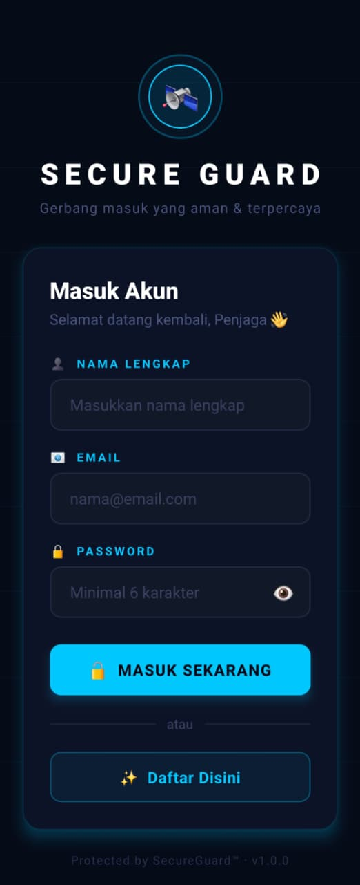

# Project M5: SecureGuard 🛰️
Tugas praktikum Minggu 5 - Navigation & Multi-Screen App.

## 📸 Preview
(app02.jpeg)

## 🛠️ Logic Implemented
- **React Navigation:** Stack Navigator untuk berpindah antar halaman Login, Register, dan Home.
- **useState Hook:** Mengelola input form, error validasi, loading state, dan visibility password.
- **Form Validation:** Validasi real-time untuk nama, email, nomor telepon, dan kekuatan password.
- **Animated API:** Entrance animation, shake effect saat validasi gagal, dan pulse animation pada avatar.
- **Password Strength Meter:** Indikator kekuatan password berbasis skor karakter.

## 🔗 Demo
[Cek di Expo Snack](https://snack.expo.dev/@vnderbilts/secureguard)